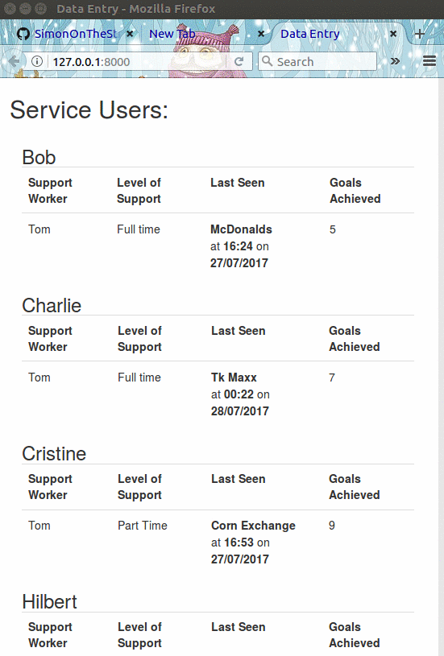

# Sample Simon On The Streets CRM

This has been built using a django framework and is only to demonstrate a possible website. At the moment all it does is display service user data from an sqllite database and link to a html page which could display more detailed info, including diary entries.

If you are unfamiliar with django you can run this app using the command python3 manage.py runserver

